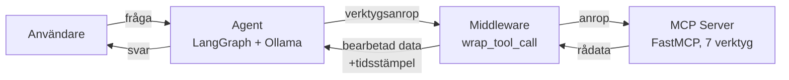

# Flödesdiagram

Diagram som visar hur agenten, middleware och MCP-servern hänger ihop.

Agenten har bara tillgång till 5 av 7 verktyg.
`search_logs` och `list_top_processes` filtreras bort i agent.py.
