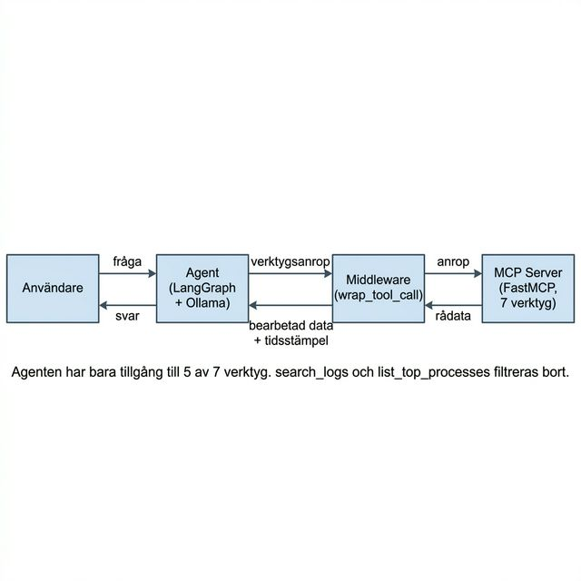

# Systemövervakare - AI Agent

Agent som kopplar till MCP-servern och låter användaren
ställa frågor om systemet på svenska.

## Vad den gör

- Kopplar till MCP-servern via HTTP
- Filtrerar verktyg (agenten har bara 5 av 7 verktyg)
- Middleware (`@wrap_tool_call`) bearbetar output innan den når agenten
- Använder Ollama (llama3.1) som LLM

## Flödesdiagram



Agenten har bara tillgång till 5 av 7 verktyg.
`search_logs` och `list_top_processes` filtreras bort i agent.py.

## Starta

1. Starta MCP-servern först:
```bash
cd ../mcp_server
source .venv/bin/activate
python server.py
```

2. Skapa `.env`:
```
OLLAMA_BASE_URL=<din url>
OLLAMA_BEARER_TOKEN=<din token>
MCP_SERVER_URL=http://localhost:8001/mcp
```

3. Kör agenten:
```bash
source .venv/bin/activate
python agent.py
```
